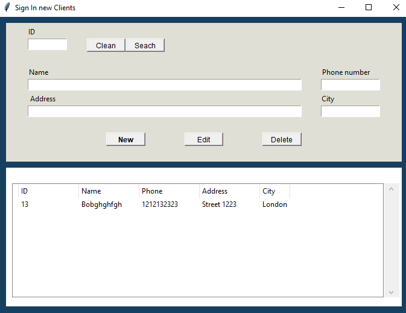

# Register Client

Register Client is a simple application built using the Tkinter library that allows users to insert clients into a database. It provides a user-friendly interface for managing client records efficiently.

## Technologies Used

- Tkinter: A Python library for creating graphical user interfaces.
- SQLite3: A lightweight, serverless database engine.

## Features

The Register Client application offers the following features:

1. Add Client: Users can enter client details such as name, address, contact information, etc., and add them to the database.
2. Delete Client: Users can remove a client from the database by specifying the client ID.
3. Search for Client: Clients can be searched using either their unique ID or their name.
4. View Database: Users can view the entire client database, including all client records.

## How to Use

1. Launch the application.
2. Enter the client details in the provided fields.
3. Click the "New" button to add the client to the database.
4. To delete a client, enter the client's ID and click the "Delete" button.
5. To search for a client, enter either the client's ID or name in the search field and click the "Search" button.
6. To edit a client, select the client and click on "Edit" button.

## Installation

1. Clone the repository:
   ```bash
   git clone https://github.com/JPCLima/Register-Client.git
   ```
2. Ensure you have Python installed on your system.
3. Run the application by executing the command `python register_client.py`.

## Screenshots



The screenshot above demonstrates the user interface of the Register Client application, where users can input client details and interact with the various features provided.
